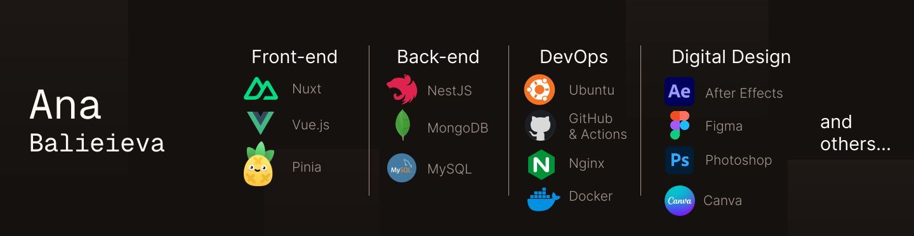

## Hi all 👋

I'm Ana, a full-stack software developer and founding engineer at FX-ATS Dev, where I build FinTech systems with **Nuxt, NestJS, MongoDB, and MT4/MT5**.

I focus on building stable, scalable, and automated systems, with an emphasis on performance, usability, and developer experience. I use tools like **GitHub Actions, Cron, Pinia,** and others to automate workflows and optimize applications.

I'm also a digital designer with **6+ years** of experience in motion design, which gives me a strong eye for UI/UX, visual systems, and frontend aesthetics.

I enjoy solving challenging real-world problems and turning complex ideas into reliable, user-friendly products.

 

 

<h2 align="center">Connect with me</h2>

  <a href="https://www.linkedin.com/in/anastasiia-balieieva-33714936a/" target="_blank">LinkedIn</a>
  &nbsp; • &nbsp;
  <a href="https://x.com/anastasiiabalv" target="_blank">Twitter</a>
  &nbsp; • &nbsp;
  <a href="https://bsky.app/profile/anastasiiabalv.bsky.social" target="_blank">BlueSky</a>

 

<h2 align="center">Languages I use</h2>

  

