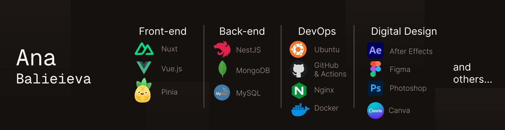

## Hi, I'm Ana 👋

### **MetaTrader & FinTech full-stack developer.** 

I've been trading for about 5 years, and I build the technical side of it myself — systems that run on real money today. At **FX-ATS Group** I built and run the in-house trading infrastructure and monitoring, live for about 2 years.

**What I build**

- **MetaTrader systems** — Expert Advisors, indicators, MT4 ⇄ MT5 trade copiers (all four directions, signals under 1 s)
- **FinTech dashboards** — real-time trading-account statistics, strategy ratings, client cabinets
- **Integrations** — MT4/MT5 ↔ web via MQL + custom APIs, broker and exchange APIs (Binance, WhiteBit), payments
- **DevOps for trading** — Ubuntu VPS, nginx, PM2, CI/CD with GitHub Actions, monitoring and live support

I'm also a motion & digital designer (After Effects, Figma) — which is why my dashboards are meant to be read, not just to work.

 

 

<h2 align="center">Work with me</h2>

  Need a MetaTrader system, a trading dashboard or an integration?

  <a href="https://dev.anastasiiabalv.com/?utm_source=github" target="_blank"><b>dev.anastasiiabalv.com</b></a>
  &nbsp; • &nbsp;
  <a href="https://www.linkedin.com/in/anastasiia-balieieva-33714936a/" target="_blank">LinkedIn</a>
  &nbsp; • &nbsp;
  <a href="https://x.com/anabalvdev" target="_blank">X</a>
  &nbsp; • &nbsp;
  <a href="https://bsky.app/profile/anabalvdev.bsky.social" target="_blank">Bluesky</a>
  &nbsp; • &nbsp;
  <a href="https://www.youtube.com/@anabalvdev" target="_blank">YouTube</a>

 

<h2 align="center">Languages I use</h2>

  

